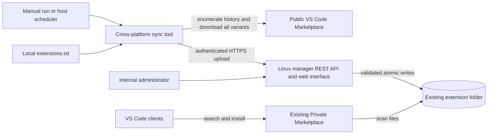

# Private Marketplace extension manager — implementation plan

Revised 16 September 2026 for a standalone cross-platform sync tool using REST exclusively and an editable extension identifier list. This document is the design roadmap. The v0.1.0 implementation and release contract are described in README.md and docs/. The delivered API uses synchronous raw-byte uploads, one operator login, and one automation token. Planned asynchronous upload jobs, granular roles, automatic visibility probes, per-version suppression, and metrics are not implemented. The Linux production deployment remains operator-managed.

## 1. Architecture: cross-platform synchronization

Use any supported Windows, Linux, or macOS computer with access to both the public marketplace and the internal REST API as the transfer machine. It reads a local extension identifier list, downloads all available versions and target-platform packages from the public VS Code Marketplace, and pushes original VSIX files to the existing Linux extension directory. Run it interactively for the first backfill and through the host operating system’s scheduler for recurring synchronization.

Retain the earlier requested Docker application, web interface, REST API, and guide as the baseline receiver. The portable command-line tool submits files to the API; the API validates them and publishes them into the shared directory. The existing marketplace continues serving that directory. GitHub Actions and runner registration are removed from the design.



REST over internal HTTPS is the only transfer mechanism. The transfer machine has no SSH/SFTP write access. The manager container receives uploads and writes to the host directory using its configured volume mount and Linux permissions; The transfer machine needs only API access and a scoped credential.

A Linux operator must initially deploy the manager, grant its container account write access to the existing extension directory, and expose the internal HTTPS endpoint. After that setup, routine synchronization and manual web uploads need no shell or filesystem access from the transfer machine. The API URL and network reachability remain deployment inputs; general connectivity to Linux does not by itself prove the new API is reachable.

The Linux application needs no connection to the public marketplace. GHCR is only an application-image distribution option through the server's existing proxy. No extension relay or server-side downloader is required.

Verify transfer-machine-to-API DNS, routing, TLS trust, and credentials under the account running the sync. Scheduled execution can have different proxy, environment, working-directory, and trust settings from an interactive account on any OS.

## 2. Meaning of “all versions”

Collect all versions that the public marketplace currently exposes and still allows downloading for each explicitly configured extension ID. This is a historical mirror of selected extensions, not a crawl of every extension in the marketplace. Unpublished or removed artifacts may not be recoverable; report those gaps rather than claiming a complete historical archive.

The required scope includes stable and prerelease records and every published target-platform variant, including universal packages. Discover platforms from the source records rather than maintaining a host-OS or fixed architecture filter. This includes available Windows, Linux, Alpine, macOS, ARM/x64, and web variants; an extension need not publish every possible combination. Neither the transfer computer's OS/CPU nor the server's Linux OS restricts the extension variants collected. Do not narrow channels, history, or platforms without an explicit scope change.

Do not filter old releases by the currently installed VS Code version. Preserve their engine compatibility metadata for display and client selection. Do not choose only the latest compatible version or retain only the most recent few releases.

The initial run backfills all discoverable versions. Every subsequent scheduled run re-enumerates the full source inventory, then downloads/uploads only missing or explicitly selected repair items. This preserves all-version coverage without repeatedly transferring the entire history. Exact duplicate uploads remain safe if the tool elects to resend files.

Keep package identity as publisher, extension name, exact version, and normalized target platform; store stable/prerelease channel as metadata. Preserve distinctions in the source, and detect conflicting metadata or bytes for the same package identity instead of overwriting. Preserve original VSIX bytes. VS Code documents separate platform packages and universal fallback behavior. [Platform-specific extensions](https://code.visualstudio.com/api/working-with-extensions/publishing-extension#platform-specific-extensions).

## 3. Components and ownership

| Component | Proposed implementation | Responsibility |
|---|---|---|
| Manager container | Go service, embedded HTML/CSS/JavaScript, embedded OpenAPI documentation | REST ingestion, web pages, validation, inventory, job status, audit records |
| State store | SQLite on a persistent local volume | Durable upload journal, file records, accounts/token metadata, optional sync-run summaries |
| Existing marketplace container | Existing Microsoft deployment | Extension discovery and downloads for clients |
| Cross-platform sync tool | Go command-line application with native Windows, Linux, and macOS builds | Enumerate versions, compare inventory, download VSIX files, upload, poll results, report failures |

Implement the CLI in Go, sharing package identity, validation, and REST contract code with the manager where appropriate. Release `marketplace-sync.exe` for Windows and `marketplace-sync` for Linux/macOS. Target x64 and ARM64 builds for each OS, with published minimum OS versions and a native test matrix. Go supports selecting OS and architecture build targets. [Go target environments](https://go.dev/doc/install/source#environment).

Ship self-contained native CLI releases: end users do not need Go, PowerShell, Python, Node, Docker, or a runner agent installed. Choose CLI dependencies that do not require an external C runtime or helper executable. Build success is not a substitute for native runtime testing. Release checksum files and document OS-specific executable permissions, signing/trust prompts, and supported OS versions. Docker packaging for the client can be optional later; native execution is the baseline.

Start with one manager replica and a bounded background validator. All UI assets and API documentation are included in the image; the server needs no runtime package downloads or public-marketplace access.

## 4. Extension list, discovery, and transfer behavior

Accept a UTF-8 `extensions.txt` file with one `publisher.extension` identifier per line. Ignore empty lines and comment lines; validate and deduplicate identifiers case-insensitively. Do not replace the user's list with an invented selection.

The list is editable operational configuration, not embedded in the executable, Docker image, or scheduled task. Read and validate it at the start of every run. A changing list is expected; a final fixed list is not required to implement the application or tool.

| List change | Next-run behavior |
|---|---|
| Add an identifier | Discover and upload its complete available history and all published platform variants |
| Keep an identifier | Recheck its complete history and transfer missing packages, including new releases |
| Remove an identifier | Stop further downloads for it; retain every package already stored |
| Re-add an identifier | Compare server inventory and resume missing history without duplicating stored packages |
| Reorder or duplicate entries | No change to the set of extensions being synchronized |
| Save an empty/comment-only list | Explicit no-op report; no transfers or deletions; do not claim a full source check |
| Supply a missing/unreadable file or invalid identifier syntax | Fail before starting transfers and report the file/line problem; do not silently use a cached list |

Take one validated in-memory snapshot per run and record its hash and normalized identifiers in local run metadata. Edits made during a run apply on the next run; display this behavior in the guide. For an immediate change, stop the current run and restart with the revised file. Already-confirmed uploads remain valid, and incomplete uploads recover through the normal journal. The manager continues accepting independent manual web uploads regardless of list membership.

Illustrative input format only:

```text
# Replace these placeholders with the user's identifiers
<publisher>.<extension-one>
<publisher>.<extension-two>
```

Keep connection settings in a separate local `sync-settings.json`, and secrets in a credential store or an ACL-protected credential file for the scheduled account. Required settings are the input path, destination URL, work directory, log directory, concurrency, and size/time limits. All versions, channels, and discovered platforms are mandatory for this job. Provide a discovery-only mode that reports coverage and expected work without uploading files.

Planned command interface, not an executable delivered yet:

```text
marketplace-sync discover --list extensions.txt --config sync-settings.json
marketplace-sync sync --list extensions.txt --config sync-settings.json
```

These command arguments are identical on every OS. Use the `.exe` filename on Windows and the appropriate executable path when it is not installed on `PATH`. Resolve relative paths inside the JSON configuration relative to that file, rather than the scheduler's working directory. Accept LF/CRLF line endings and a UTF-8 BOM in the identifier list.

Discovery uses the marketplace's version metadata and per-version VSIX asset references. Validate the adapter against Microsoft's current VS Code gallery implementation and freeze representative response fixtures. That implementation exposes version records, platform metadata, prerelease properties, and VSIX assets; it is an implementation reference rather than a promise of a stable public API. [Microsoft gallery implementation](https://github.com/microsoft/vscode/blob/main/src/vs/platform/extensionManagement/common/extensionGalleryService.ts).

The adapter must request historical version records and associated files/properties while omitting latest-only and client-compatibility filters. Microsoft's gallery capability definitions distinguish `IncludeVersions` from `IncludeLatestVersionOnly` and `IncludeLatestPrereleaseAndStableVersionOnly`. Handle pagination where applicable and investigate response limits before asserting source completeness. [Gallery query capabilities](https://github.com/microsoft/vscode/blob/main/src/vs/platform/extensionManagement/common/extensionGalleryManifest.ts). Do not assume increasing an extension-query page size necessarily increases the number of versions returned per extension. Use actual asset URLs or a verified exact-version endpoint, not a `latest` download URL. Handle redirect hosts correctly without sending internal API credentials to marketplace/CDN hosts.

Transfer sequence:

1. Verify CLI/API version compatibility, configuration, local disk space, API readiness, and source connectivity before downloading a large history.
2. Enumerate all source records for each configured extension; record the enumeration time and any incomplete discovery.
3. Retrieve the API's paginated inventory or use its batch-check endpoint. Only skip server records that are durably stored and consistent with source identity/metadata. Flag suspicious changes for explicit verification rather than assuming an upstream checksum exists.
4. Build a missing-package list and report its count and estimated storage where source sizes are available. Process each extension from its earliest discoverable release through the most recent, including every platform record for each release. Use release metadata and semantic version ordering as appropriate, never lexical version sorting. Report backfill as incomplete until every discovered item has a recorded result.
5. Stream a VSIX into a unique temporary work directory, calculate SHA-256, and check its expected identity. Never install or execute it on the transfer machine.
6. Upload the original file and expected identity/hash to the internal API. Poll the returned upload ID until it is stored or rejected; receiving an HTTP acceptance response is not proof of storage.
7. Delete that local temporary file only after durable server confirmation, or after explicitly recording a failure that can be retried. Bound concurrent downloads and total temporary bytes.
8. Continue independent packages after individual failures. Report attempted, stored, already present, unavailable, rejected, and failed items. Finish with a nonzero exit code for unresolved required items or incomplete enumeration.
9. Optionally submit a run summary to the API for the dashboard. A failed summary submission must be visible in the local run log and must not imply uploaded files were lost.

Use bounded exponential backoff with jitter for transient network errors, timeouts, 429, and appropriate 5xx responses; honor `Retry-After`. Do not repeatedly retry authorization failures or invalid VSIXs. After an ambiguous upload response, check its idempotency key/job status before resending. Re-enumerate disappeared records on later runs, and retain already-stored copies.

A failed package does not roll back successful packages. There is no whole-catalog promotion barrier: each validated file is independently published. A rerun resumes from server inventory, even if the computer or its operating system has been replaced or its work directory cleaned. Byte-range upload resume is deferred unless actual package sizes require it; retrying an interrupted individual file is sufficient for the initial design.

Dependencies and extension-pack members are reported from package manifests. They do not automatically expand the configured extension list or block archival of older packages. The guide explains how to add required extension IDs for functional client installations. Dependency completeness and successful file mirroring are separate outcomes.

## 5. REST API contract

Use `/api/v1` at the manager's own internal address. The cross-platform tool can use the upload and status endpoints alone; inventory checks and run summaries improve efficiency and visibility.

| Method and path | Behavior |
|---|---|
| `POST /api/v1/extensions` | Stream one multipart VSIX plus expected identity, SHA-256, and optional run metadata |
| `GET /api/v1/uploads/{uploadId}` | Durable validation/publication result and error details |
| `GET /api/v1/uploads/by-key/{key}` | Recover a result after an ambiguous upload response |
| `GET /api/v1/extensions` | Paginated extension inventory |
| `GET /api/v1/extensions/{extensionId}/versions` | Paginated historical versions with platform/channel/status/hash filters |
| `POST /api/v1/extensions/check` | Bounded batch lookup of package identities and optional hashes |
| `GET /api/v1/packages/{packageId}` | Metadata, provenance, checksum, and observation state |
| `GET /api/v1/packages/{packageId}/download` | Authorized download of original bytes |
| `POST /api/v1/sync-runs` | Optional start record with locally generated run ID, client host label, CLI version, and list/configuration hash |
| `PATCH /api/v1/sync-runs/{runId}` | Optional progress or final report with enumeration and failure counts |
| `GET /api/v1/sync-runs` | Paginated run history |
| `GET /api/v1/audit-events` | Authorized administrative audit history |
| `GET /health/live` | Process liveness |
| `GET /health/ready` | Database and writable-storage readiness |
| `GET /metrics` | Internally restricted metrics |

An upload uses `Authorization: Bearer ...` and `Idempotency-Key`. Respond with `202 Accepted` only after the incoming file and job record are durably staged. The worker validates and publishes asynchronously. Return a stable upload ID and status URL. A request that repeats an already-completed identical upload can return `200` with that result.

The authoritative rule is immutable content: same identity and same bytes is a no-op; same identity with different bytes is `409 Conflict`. Persist idempotency keys and reject reuse with a different request identity/hash. Recompute the hash on the server; a client-provided hash alone is not proof of integrity or publisher authenticity.

Use structured errors: `400` malformed request, `401/403` authentication/authorization, `413` size limit, `422` invalid package, `429` concurrency/rate limit, and a documented storage-capacity error such as `507`. Include a request ID and stable machine-readable error code.

Track `received`, `validating`, `stored`, and `rejected` upload states. Track marketplace observation separately as `visible`, `pending`, or `unverified`; lack of visibility must not cause repeated uploads of a file already stored correctly. Sync-run completion means all enumerated required packages were stored or already present. The server validates its own upload counts and labels source enumeration claims as collector-reported.

The API accepts files, not destination paths, shell commands, or arbitrary download URLs. Configuration chooses the host directory once. The web UI uses the same validation/publication path as automation.

## 6. Storage, existing files, and marketplace behavior

Microsoft's marketplace reads VSIX files from its configured source directory; publishing consists of writing packages to that storage. [Microsoft publishing guide](https://github.com/microsoft/vsmarketplace/blob/main/privatemarketplace/latest/README.md#4-publish-extensions-to-the-container).

Mount the existing host folder read/write into the manager. Preserve the marketplace's current mount, preferably read-only if compatible with existing operations. Use a configurable non-root UID/GID; the server's filesystem permissions must permit publication. Record the actual marketplace image version/digest and source path before deployment.

Illustrative layout:

```text
/srv/private-marketplace/extensions/      existing published VSIX folder
/srv/private-marketplace/manager-state/   local SQLite database and job records
/srv/private-marketplace/quarantine/      rejected or operator-withdrawn files
```

Generate canonical filenames including extension ID, exact version, and platform. Do not use a single filename per extension or overwrite prior versions. On first startup, inventory pre-existing files as externally managed. Validate and reconcile matching files before skipping uploads; never rename, replace, or delete unmanaged files automatically.

Stream uploads into random `.part` filenames on the same filesystem as the destination, outside the scanner's `*.vsix` matching pattern. Validate size limits, ZIP structure, required manifests, identity consistency, hash, archive entry count, decompressed limits, and dangerous paths. Reject traversal, symlinks, duplicate conflicting entries, and unsafe XML features. Read only required entries; never execute package code or extract arbitrary content onto the host.

A structurally valid historical package is not rejected merely because it targets another OS or an old VS Code engine. Reject unsupported archive formats explicitly and include them in the historical coverage report rather than silently skipping them.

Flush staged content, publish using an atomic same-filesystem no-clobber operation, and persist a recovery journal around publication/database updates. Protect against symlink races and concurrent writes. Atomicity is per file. Startup reconciliation repairs a crash between filesystem publication and metadata commit. Stale staging cleanup must not race active uploads.

Keep SQLite on a supported local filesystem even if the extension mount is a network share. Test the actual share's publication semantics. Bound upload queues and staging bytes; reject early when space is insufficient and preserve existing extensions on ENOSPC.

No automatic version pruning is planned because all versions are required. Removing an ID from the input list stops future transfers; it does not delete stored files. Estimate disk, inode, marketplace startup/refresh time, cache size, and client-query performance using a representative full-history pilot. Do not silently trade away versions to fit a quota.

Verify how the deployed marketplace handles multiple versions of the same extension, platform variants, prereleases, file additions, and removals. The manager can guarantee stored files; whether every historical version is offered through VS Code depends on that marketplace behavior. Treat this as an explicit pilot gate and report any limitation. Measure refresh delay rather than assuming an immediate scan or undocumented refresh API.

## 7. Web pages and access control

Provide an offline-capable internal interface with:

- Dashboard: stored package/version counts, disk usage, pending/rejected uploads, latest upload, and latest reported successful enumeration.
- Inventory: extension search and version/platform/channel filters, with all historical records paginated.
- Package details: exact identity, checksum, size, source, engine compatibility, dependency metadata, ownership, and marketplace observation.
- Upload page: single/multiple manual VSIX uploads with progress, validation feedback, and conflict handling.
- Transfer history: optional sync-run reports, incomplete backfills, missing/unavailable packages, and exportable JSON/CSV diagnostics.
- Embedded guide: REST contract, portable CLI examples, optional PowerShell/curl examples, deployment, authentication, and troubleshooting.

The UI does not initiate collection jobs. Scheduling and the editable extension identifier list stay on the transfer machine. If run reporting is omitted, the dashboard says that collection freshness is unknown; latest-upload time is not evidence of a recent successful no-change collection.

Use individual local accounts with hashed passwords, secure HTTP-only same-site session cookies, CSRF protection, and login rate limits. Provide viewer, uploader, and administrator roles. Store hashed automation tokens with upload/read-inventory/report scopes, rotation, and revocation. Automation receives no deletion privilege. Corporate SSO can be integrated later if required.

Serve over internal HTTPS, using an existing reverse proxy if available. Trust forwarded headers only from that proxy. Escape untrusted extension metadata and sanitize any rendered README; do not fetch public fonts, scripts, icons, or images from the user's browser automatically.

## 8. Portable execution, scheduling, and machine replacement

Use Go streaming HTTP clients for downloads and multipart uploads. Keep memory bounded, close streams on cancellation, and implement timeouts, proxy settings, custom CA-bundle support, and connection reuse inside the CLI. Do not shell out to PowerShell, curl, or platform-specific file-transfer commands. Test system certificate trust and any corporate interception CA on each supported OS; never disable TLS verification as a portability shortcut.

Keep `extensions.txt` and non-secret `sync-settings.json` portable. Use OS-aware filesystem/path APIs and a versioned local manifest format. For native builds, implement safe state-file replacement, process locking, interruption handling, permissions, and Unicode/path-with-spaces support on every supported OS. Do not assume Unix file rename or signal behavior applies unchanged on Windows.

The portable secret interface is `--token-file` pointing to an access-restricted file or a secret-file location supplied by the scheduler. The non-secret config may reference that path. The guide documents Windows ACLs and Unix file modes; secrets do not go in the identifier list, source-controlled settings, command-line values, or logs. Optional OS credential-store integrations can be added without changing the sync protocol. Provision a fresh client token when replacing the machine; revoke the previous token as part of retirement. Encrypted credentials tied to one OS/account are not portable state.

Persist per-package identity, channel, platform, source reference, size/hash, discovery timestamp, download state, upload/job ID, server confirmation, and last error. Generate a new run UUID. Local checkpoints and downloaded caches improve performance but are not necessary to resume: the server inventory is authoritative. Local files alone are never proof of successful upload.

Initial execution is interactive, showing extension/version/platform counts and progress. Full-history collection may take many hours and span restarts. Bound in-flight disk usage and concurrency; release temporary VSIX files after server confirmation unless a local archive is explicitly requested. A replacement machine can re-download an interrupted individual file without retransferring the entire history.

Use one common `sync` command for manual and scheduled operation, exiting when the pass or configured time budget ends. Scheduling remains an external deployment concern:

| Client OS | Recurring execution | Delivered setup |
|---|---|---|
| Windows | Task Scheduler | Registration instructions/template using the native executable |
| Linux | systemd timer, or cron on hosts without systemd | Service/timer example and cron alternative |
| macOS | launchd | LaunchAgent/LaunchDaemon example appropriate to the execution account |

Windows supports scheduled program execution, and macOS supports launchd-managed jobs. [Windows scheduling](https://learn.microsoft.com/en-us/powershell/module/scheduledtasks/register-scheduledtask?view=windowsserver2025-ps), [Apple launchd guide](https://developer.apple.com/library/archive/documentation/MacOSX/Conceptual/BPSystemStartup/Chapters/CreatingLaunchdJobs.html). Scheduler templates are documentation/artifacts only until the operator installs them.

Propose a daily run at 02:17 in an explicitly documented host timezone; use Asia/Seoul if chosen for the deployment. Supply absolute executable/config/list/credential paths and set the execution account. Document differing missed-run and sleep behavior across schedulers; use the available catch-up setting, with a manual/startup catch-up where needed. Do not claim all three schedulers have identical semantics. Use a client process lock to prevent overlap on one host. Server-side immutable identity/hash handling protects against overlap across different hosts.

Machine replacement procedure:

1. Disable the old schedule and stop the old sync process when the machine is available.
2. Install the matching CLI release on the new OS/CPU. Copy the identifier list and non-secret settings from a backup or the old machine.
3. Adjust local paths, provision the credential, and configure proxy/CA trust. An `extensions.txt` backup is required because server inventory includes removed IDs and manual uploads and cannot reconstruct the intended active list.
4. Run the CLI preflight and discovery, query the existing server inventory, and transfer only missing packages. Copying the cache or manifest is optional. If the old machine was lost, completed uploads are still discoverable from the API.
5. Install the new host's schedule and retire the old token. If the old client is unexpectedly still running, duplicate submissions remain idempotent.

Acceptance criterion: upload part of a backfill on Windows, then continue on Linux or macOS with a fresh local state directory. The new client must skip server-confirmed packages, finish missing history, and preserve all versions and target variants.

A powered-off/disconnected transfer machine cannot transfer packages. Re-enumerate the entire current list after reconnecting. Never delete archived versions because the source or input list changed. Preserve per-run reports for discovered, already stored, uploaded, unavailable, rejected, and failed items, plus oldest/newest versions, platforms, and source-enumeration time.

Exit zero only when enumeration succeeds and all required discoverable packages are stored/already present; empty-list no-op behavior remains explicit. Partial success retains valid files but exits nonzero with details. Track last completed source check separately from latest upload; a successful no-change run refreshes check status. Propose a configurable 36-hour freshness threshold for daily operation.

If the process dies, expire the optional run heartbeat into an interrupted state. Preserve local diagnostics even when API reporting fails. Server storage confirmation and marketplace visibility remain separate states.

## 9. Container deployment and operations guide

Deliver a Dockerfile, Compose example, environment reference, OpenAPI file, native CLI release archives with checksums, list/settings examples, scheduling templates for all three operating systems, and embedded/operator documentation. The Compose example adds only the manager and its state volume beside the existing marketplace. Build the Linux application image separately on a suitable development/build machine. The cross-platform sync tool only discovers, downloads, verifies, and transfers VSIX files; GitHub is not a deployment prerequisite.

Publish the application image to a registry the Linux server can pull, including GHCR through its current proxy. Pin production deployment to an image digest. Include runtime dependencies and UI assets in the image; no builds or public downloads run on the restricted server. Configure proxy/CA trust for image pulls separately from application traffic.

Use a non-root process, read-only root filesystem, explicit writable mounts, dropped capabilities, resource limits, health checks, and secret files. No Docker socket or privileged mode is needed.

The guide covers operator-performed container installation and mount permissions, initial host-folder backup, UID/GID configuration, token creation, HTTPS setup, scheduled-account connectivity checks, a one-file upload, full-history backfill, recurring runs, editing the identifier list, disk monitoring, and diagnostics for 401/403, 413, conflict, timeouts, and full disk. Updating the list requires no image rebuild, service restart, or scheduled-task re-registration.

Back up VSIX files, the database using a consistent SQLite backup procedure, and configuration/secret recovery material. Document restoring file inventory and upload journals. Application rollback must account for database migrations. Do not silently downgrade or delete extension versions during application rollback.

An operator may need to withdraw a bad package: document pausing uploads for that identity, quarantining it with an audit record and a persistent suppression record, and verifying the marketplace refresh. A simple deletion would otherwise be undone by the next all-version sync. Retain the file outside the scanned folder where policy allows. Already-installed client versions require a separate client-side recovery procedure.

## 10. Implementation order and acceptance tests

| Phase | Deliverables | Acceptance gate |
|---|---|---|
| 1. Connectivity and historical-version pilot | Sample enumeration/download, one-file API prototype, real marketplace behavior report | Execution accounts on Windows, Linux, and macOS download a specific old VSIX and send it to the Linux API; multiple versions/platforms coexist and actual client visibility is measured |
| 2. Durable ingestion | Docker application, authentication, validation, atomic storage, inventory, OpenAPI | Interrupted/duplicate/conflicting uploads and full disk preserve correct existing files |
| 3. Web interface and guide | Inventory/history, manual upload, accounts, embedded API/operator docs | An operator uploads and diagnoses a rejected package without shell access |
| 4. Cross-platform tool | Go collector/uploader, native releases, identifier list, local configuration, scheduling templates, reports | Initial all-version backfill completes; rerun skips stored packages and a new release is added without replacing old versions |
| 5. Operational pilot | Capacity measurements, backups, metrics, failure recovery, final guide | Scheduled runs, transfer-machine outage, missing source versions, API outage, and restore drills produce accurate status |

Essential tests: historical enumeration beyond any default limit; stable/prerelease and universal/platform variants; unsupported or disappeared old versions; old engine compatibility retained; same identity with changed bytes; pagination; concurrent manual/scheduled upload; crash before/after atomic publication; process cancellation; ambiguous API response; API polling timeout; source rate limits; malformed/traversal archives; proxy and CA errors; disk exhaustion; preservation of unmanaged files; no automatic pruning; suppression preventing unwanted re-upload.

Cross-platform tests: execute the same discovery/transfer fixtures natively on Windows, Linux, and macOS; verify x64/ARM64 release compatibility before claiming support; test OS-specific paths, line endings, locking, cancellation, proxies, CA trust, secret-file permissions, and scheduler accounts; migrate mid-backfill across operating systems with no local cache and verify recovery from server inventory. Keep CLI/API schema compatibility explicit and reject unsupported major API versions with a useful error.

List-lifecycle tests: add an ID after an earlier completed run and backfill its history; remove it without deleting files; re-add it and skip stored packages; edit the list during a run and apply the new snapshot only on the next run; deduplicate mixed-case entries; distinguish an empty list from a missing or invalid file; and preserve unrelated manual uploads through every list change.

No server access is assumed during development. Provide an operator-run integration test pack for the actual Linux container and scheduled accounts on each supported client OS. Test fixture-backed discovery locally and verify current marketplace behavior on representative real packages during the pilot.

## 11. Required inputs before downloading and uploading

The confirmed collection scope is the user's extension identifier list, every available historical release through the latest, and every published OS/architecture variant, including universal and prerelease packages. Do not narrow that scope.

A fixed identifier list is not an implementation prerequisite. At first execution, the user supplies a local list file and can edit it over time. Deployment requires the REST API URL, a scoped credential, and an operator-provisioned writable container mount; SSH/SFTP access is not required. The current REST receiver is planned, not already deployed.

Also record the actual extension-directory mount/permissions, marketplace image version, storage capacity, transfer-machine OS/CPU and executable compatibility, scheduled-account proxy/credential access, and desired schedule. Ask for secret provisioning through the deployment procedure rather than requesting passwords or API tokens in chat.

Complete a small representative integration test before the full backfill: one oldest available version, one latest version, and multiple platform variants for the same extension. Verify exact bytes, coexistence in the directory, interrupted-transfer recovery, and behavior in the deployed marketplace. Missing or unpublished historical assets must be listed explicitly; no method can upload bytes the source no longer makes available unless a separate archive is supplied.
